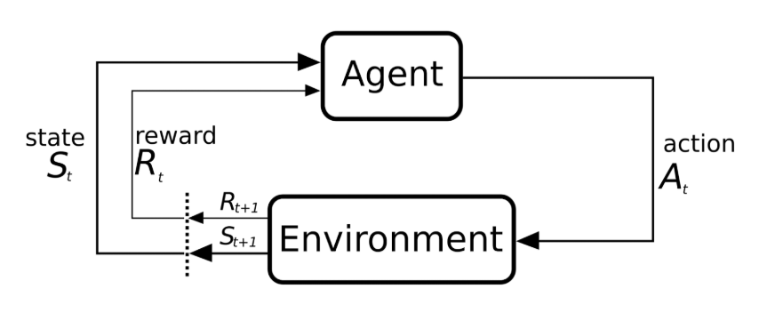

# Budget_Allocation_DRL

Advancements in budget allocation within portfolio management have been significantly influenced by the integration of artificial intelligence (AI) and machine learning techniques. A notable development is the application of Deep Reinforcement Learning that combines the strengths of reinforcement learning and deep learning, particularly well-suited for solving complex decision-making problems where an agent learns to achieve goals through trial and error, guided by feedback in the form of rewards.

By interacting with an environment like in Figure 1,  and making decisions through a policy 𝜋 that takes actions. The objective is to find the optimal policy $\pi^*$ that maximizes the future rewards.

$$
\begin{equation}
\pi^* = \arg \max_{\pi} 
\end{equation}
$$

It is well known that today's DeepRL algorithms are able to learn advanced strategies, achieved through algorithms such as Deep Q-learning, Policy Gradient, Actor-Critic models, together with exploration/exploitation trade-off. These strategies can also be transferred to industrial applications such as robotics, gaming, finance, healthcare, among others.

Specifically for the problem of budget allocation in investment portfolios, we define our Markov Decision Process (MDP) as follows:

- States ($S_t$): The state at time t, captures the current market conditions and portfolio composition. This may include features such as asset prices, returns, volatility, macroeconomic indicators, and the current allocation of funds across assets. The signal features we used as states were 7-day and 30-day volatility, and the price trend at 3, 7, and 15 days.
- Action ($A_t$): The action are percentages of how much money must be distributed in each of the assets.
- Reward ($R_t$): The reward is a numerical value that reflects the performance of the portfolio after taking an action. In our case we are taking Sharpe ratio.
- Discount factor 𝛄: for our case, we are taking it at 0.99.
- Policy ($\pi$): The policy is the strategy the agent uses to determine the best action given the current state. That is why our experiment rely on [2], where the author proposes to use a deterministic policy, based on an optimization problem, where the idea is to maximize the State-Value function, which is,

$$V^{\pi}(s) = \mathbb{E}^{\pi} [G_t \mid S_t = s] = \mathbb{E}^{\pi} \left[ \sum_{k=0}^{\infty} \gamma^k R_{t+k+1} \mid S_t = s \right]$$

where $G_t$, represents the total discounted returns starting from time t.

Using this state-value function, we have that the problem to be optimized is as follows, 

$$
\begin{equation}   
\begin{array}{ll}
  \underset{x}{\text{maximize}} & V(s) - \frac{(x-x')^2}{n} \qquad \quad \quad \\
   \text{subjet to} & \sum_{i=1}^n x_i = 1 \\
   & 0 \leq x_i \leq 1 \\
\end{array}
\end{equation}
$$

where, 

- $x=(x_1,...,x_n)$, represents the optimal distribution to be found.
- The state $s$ depends on $x$, i.e., $s=(s_1,s_2,...,s_k, x_1,..., x_n)$, where $s_i$ are signals \newline of our stocks or market.
- $x'$ the distribution made at time $t-1$, and is part of the state variable. 
- The penalization factor $\frac{(x-x')^2}{n}$, is added for no aggressive changes.

To estimate the state-value function through a neural network, we do so following the similar estimation strategy for Deep Q-learning, where the cost function for the case of the Value function is

$$\mathbb{E} \left[(G_t - V(s,\theta))^2 \right]$$

Readers should be aware that the state representations used in the Markov Decision Process (MDP) may be limited and could be enhanced with additional market information or features deemed relevant, and allows the model to detect market shifts. Furthermore, the neural network model can be improved by modifying its architecture to enhance performance and capture more signals from the input states, as long as you carefully monitor performance metrics like overfitting and sensitivity to hyperparameters.

# Reference

[1] Richard S. Sutton and Andrew G. Barto, Reinforcement Learning An Introduction, The MIT Press 2014.

[2] Yves J. Hilpisch, Reinforcement Learning for Finance, O'Reilly Media, Inc. October 2024. 

[3] Trade That Swing. Average Historical Stock Market Returns for S&P 500: 5-Year up to 150-Year Averages. Accessed January 14, 2025. 

[4] Trade That Swing. Historical Average Returns for NASDAQ 100 Index (QQQ).  Accessed January 14, 2025. 

[5] Benhamou, E., Saltiel, D., Ungari, S., & Mukhopadhyay, A. (2020). Bridging the gap between Markowitz planning and deep reinforcement learning. arXiv preprint arXiv:2010.09108.

[6] AMSFlow. NASDAQ 100 Historical Returns. Accessed April 8, 2025. 

[7] AMSFlow. S&P 500 Historical Returns. Accessed April 8, 2025.

$\mathbb{E}_{\tau} \left[ \sum_{t=0}^\infty \gamma^t R_t \right]$